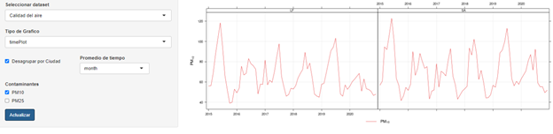
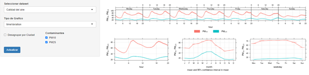
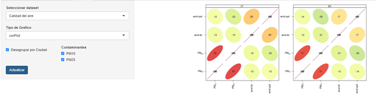
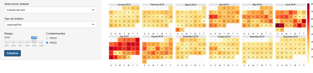
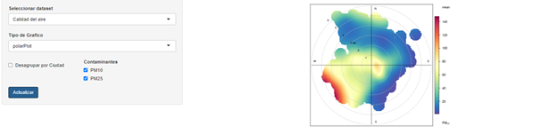
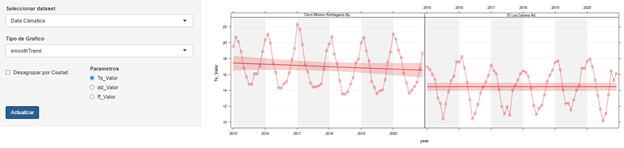
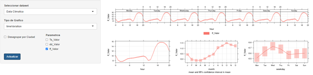

# Summary

The study of air quality has taken an increasingly important role in the generation of public policies, this due to the effects that air pollution causes on the health of people and animals, affecting vegetation, soil and materials. , limiting visibility and the potential to contribute significantly to climate change.

One of the main difficulties faced by the study of air quality is the enormous volume and disintegration of data collected daily, so the development of data analysis techniques plays an essential role in this. countryside.

In the case of Chile, the main open source data are reported by the National Air Quality Information System [(SINCA)](https://sinca.mma.gob.cl/) under the [(Ministry of the Environment of Chile)](https://mma.gob.cl/), which collects air quality data from X stations throughout the country; and the National Meteorological Directorate [(DMC)](https://climatologia.meteochile.gob.cl/) dependent on the General [Directorate of Civil Aeronautics of Chile](https://www.dgac.gob.cl/), which stores meteorological data from 47 stations throughout the country.

`AtmChile` is an R package that allows downloading and managing data from SINCA and DMC for multiple parameters of air quality and meteorology, offering quick and easy access for researchers. This package includes `ChileAirQualityApp` a dashboard that integrates the download tools of this package with visualization tools and descriptive statistics analysis in a user-friendly way.

The `ChileAirQualityApp` dashboard is displayed in five tabs. Different packages used for building `ChileAirQuality` include  `data.table`, `plotly`, `shiny`, `openair`, `lubridate`, `shinycssloaders` and `DT`.

# Statement of need

The air quality data offered by the SINCA and the DMC are offered with high levels of disaggregation: separated by monitoring station, parameter and by year, in In the case of the DMC, this makes it difficult for researchers trying to compile large data sets. `AtmChile` offers a simple solution to this problem by:

1. Access and management of the open source databases of SINCA and DMC

2. Application of data quality control options

This package was implemented in a web platform designed with Shiny offering to generate  visualizations and summaries of the main statistical parameters.

To our knowledge, there is currently no application that can generate usable summary statistics and graphs using data from the contamination databases from SINCA and/or DMC. However, there are some Shiny apps that deal with data cleansing and visualization of pollution data collected from single/multiple air quality instruments.

# Package Overview

The package contains 3 functions: `ChileAirQuality` to download air quality data from SINCA open source servers; `ChileClimateData` to download meteorological data from open source DMC servers and `ChileAirQualityApp` a Shiny Dashboard for the data download functions of this package enhanced with analysis, visualization and descriptive statistics tools.

`ChileAirQuality` is a function that compiles in a data frame air quality data from the National Air Quality System (SINCA). The input variables are: a) `Comunas`: string vector that can contain the monitoring stations listed in ***Annex I***; b) `Parametros`: string vector that can contain the parameters listed in ***Annex II***; c) `fechadeInicio`: string containing the start date of the data request in format (dd / mm / yyyy); d) `fechadeTermino`: string containing the end date of the data request in in format; e) `Curar`: allows to replace as `NA`, the values that do not meet the conditions: i) *PM25 < PM10*; ii) *(NO2 + NO) < NOX*; iii) *0 < HR < 100* and iv) *0 < wd < 360* if they exist; f) `Site`: logical value that allows entering the code of the monitoring station, listed in ***Annex I***, in the variable `Comunas`; and g) `st`: logical value that includes validation reports from SINCA *"NV"*: No validated, *"PV"*: Pre-validated and *"V"*: Validated.

*Example:*

            df <- ChileAirQuality(Comunas = "Cerrillos", Parametros = c("PM10, PM25"),
            fechadeInicio = "01/01/2020,", fechadeTermino = "01/01/2021",
            Curar = TRUE, Site = FALSE, st = FALSE)

`ChileClimateData` is a function that compiles meteorological data from the Chilean Meteorological Directorate (DMC). The input variables are: a) `Estaciones`: string vector with the codes of the monitoring stations listed in ***Annex III***; b) `Parametros`: string vector that may contain the parameters listed in ***Annex IV*** c) `inicio`: initial year of the data request; d) `fin`: final year of the data request and e) `Region`: logical parameter, when region is `TRUE`, it allows entering the administrative region in which the station is located instead of the station code and listed in ***Annex III***.

*Example:*

        df2 <- ChileClimateData(Estaciones = "II", Parametros = "Temperatura",
        inicio = "2020", fin = "2021", Region = TRUE)

`ChileAirQualityApp` is a dashboard that allows you to use the data download functions of this package enhanced with analysis, visualization and descriptive statistics tools.

`ChileAirQualityApp` is hosted online on [*shinyapp.io*](https://chileairquality.shinyapps.io/chileairquality/) and can be used to serve locally with the AtmChile package. Run `ChileAirQualityApp` as follows:

        AtmChile::ChileAirQualityApp()

# App Display

The ***Data Calidad del Aire*** tab allows the user to use the `ChileAirQuality` function to download, within the application, information from the SINCA servers for the parameters listed in ***Annex II*** for the monitoring stations of the Metropolitan Region (RM) and the Region of Aysen (XXI). The option `Curar` of  `ChileAirQuality` is found as a checkbox working as previously described.The tab includes the *"Download"* button to download the dataset in case you want to use it locally.

The  ***Data Climatica*** tab allows the user to use the `ChileClimateData` function to download, within the application, information from the DMC servers for the parameters listed in ***Annex IV*** according to the administrative division of the country. The tab includes the *"Download"* button to download the dataset in case you want to use it locally.

The ***Graficas*** tab allows the user to generate visualizations of the downloaded data integrating various options of the `OpenAir` package. Some of the main options are summarized in **Table 1**:

**Table 1**: *Summary of the main display options offered in the "Graficas" tab*

 Option       | Plot type   | Air Quality | Met. Data | Ungroup stations| Adjust time scale| Adjust variables|
--------------|-------------|-------------|-----------|-----------------|------------------|------------------|
timePlot      |	Temporal    | **X**       | **X**     | **X**           | **X**            |    
timeVariation | Temporal    | **X**       | **X**     | **X**           |                  | 
CorPlot	      | Correlation | **X**       | **X**     | **X**           |                  |  
polarPlot     | Polar	      | **X**       |           | **X**           |                  |  
scatterPlot   | Correlation | **X**       |           | **X**           |                  | **X**  
calendarPlot  | Temporal    | **X**       | **X**     |                 | **X**            |   
smoothTrend   | Temporal    | **X**       | **X**     | **X**           |                  |                    |

The ***Resumen*** tab offers to generate summaries of descriptive statistics such as: mean, median, standard deviation and coefficient of variation. The tab includes the "Download" button to download the statistical summary in case you want to use it locally.

The ***Información*** tab contains summary tables with the parameters considered in the *“Data Calidad del Aire”* and *"Data Climatica”* tab, along with a map with the geographical locations of the stations considered in the *“Data Calidad del Aire”* tab.

# Limitations

a) Limited meteorological and air quality variables.
b) Limited availability of monitoring stations with the application.
c) Multiple datasets cannot be downloaded and compared at the same time.
d) No interactive or statics plots.
e) The user requires precautions on the interpretation of the visualizations and the statistical parameters.

# Installation

The `AtmChile` package can be installed and load from CRAN repository as follows: 

        install.packages("AtmChile")
        library(AtmChile)

# Case study

For a better understanding of the functionality of `ChileAirQualityApp`, we present a case study based on 5 years of pollution data set from SINCA and 5 years of meteorological data set from DMC.

## Air Pollution

The pollution data was downloaded from SINCA using `ChileAirQualityApp` for the monitoring stations “Parque O’Higgins” and “La Florida” between 2015 and 2020 using the parameters “PM10”, “PM25”, “ws”(wind speed) and “wd”(wind direction).

The data was downloaded from SINCA for the monitoring stations located at Parque O’Higgins and La Florida between the years 2015 and 2020. **Figure 1** show a time series plot generated with the option “timePlot” for PM10 with a month average time resolution.

**Figure 1:** *PM10 Monthly time series for the monitoring stations La Florida (LF) and Parque O’Higgins (SA) between 2015 and 2020.*

**Figure 2** show the time series plot generated with the “timeVariation” option for PM10 and PM25 for combined monitoring stations. This option generates four graphs: hourly variation according to the average day of the week, hourly variation in the average day, monthly variation in an average year and daily variation in the average week with a confidence interval of 95%.

**Figure 2:** *PM10 and PM25 times series for combined monitoring stations between 2015 and 2020 generated with the timeVariation option.*

Correlations between PM10, PM25 and the meteorological variables wind speed and wind direction are shown in **Figure 3** by means of a plot generated with the corPlot option separated according to the monitoring station. The coded correlation is observed in three ways: by shape (ellipses), color and numerical value.

**Figure 3:** *PM10, PM25, wind speed and wind direction correlation plot for the monitoring stations La Florida (LF) and Parque O’Higgins (SA).*

The calendarPlot option generates a calendar with the daily averages of a certain parameter with a scrollbar to filter the time interval. In this case, it was applied for PM25 during the year 2019 as shown in **Figure 4**.

**Figure 4:** *PM25 Calendar Plot for combined monitoring stations in 2019.*

The polarPlot function plots a bivariate polar graph of how concentrations vary with wind speed and direction. **Figure 5** represents the polar graph for the monitoring stations La Florida (LF) and Parque O'Higgins (SA).

**Figure 5:** *PM25 Polar Plot for the monitoring stations La Florida (LF) and Parque O’Higgins (SA).*

## Meteorological data

The data was downloaded from DMC for the monitoring stations located at the Antofagasta Region considering the meteorological stations of Cerro Moreno Antofagasta Ap. And El Loa Calama Ad. between the years 2015 and 2020 for the parameters “Ts”(dry air temperature) “dd”(wind direction) and “ff”(wind speed).

**Figure 6** show a time series plot generated with the option “smoothTrend” for Temperature(“Ts_Valor”) showing the monthly averages and the linear trend of the temperatures in that period of time.

**Figure 6:** *Temperature time series plot for the meteorological stations of Cerro Moreno Antofagasta Ap. And El Loa Calama Ad. between the years 2015 and 2020. Generated with the option “smootTrend”.*

The timeVariation option can also be used on the parameters of the DMC meteorological stations. **Figure 7** shows the time series generated with this option for the combined meteorological stations of the Antofagasta Region between 2015 and 2020.

**Figure 7:** *Temperature times series for combined meteorological stations between 2015 and 2020 generated with the timeVariation option.*

# Acknowledgments

# References

# Anexo I: ChileAirQuality monitoring stations

N° |Code      |Latitude    |Longitude    |Station                   | Ad. division |
---|----------|------------|-------------|--------------------------|--------------|
1  | SA       |  -33.4508  |  -70.6604   | P. O'Higgins             | RM           |
2  | CE1      |   -33.4795 |  -70.7190   | Cerrillos 1              | RM           |
3  | CE       |  -33.4824  |  -70.7039   | Cerrillos                | RM           |
4  | CN       |   -33.4197 |  -70.7317   | Cerro Navia              | RM           |
5  | EB       |   -33.5336 |  -70.6659   | El Bosque                | RM           |
6  | IN       |   -33.4089 |  -70.6508   | Independecia             | RM           |
7  | LF       |   -33.5032 |  -70.5879   | La Florida               | RM           |
8  | LC       |   -33.3634 |  -70.5230   | Las Condes               | RM           |
9  | PU       |   -33.4244 |  -70.7498   | Pudahuel                 | RM           |
10 | PA       |   -33.5779 |  -70.5941   | Puente Alto              | RM           |
11 | QU       |    -33.336 |  -70.7235   | Quilicura                | RM           |
12 | QU1      |   -33.3525 |  -70.7479   | Quilicura 1              | RM           |
15 | AH       |   -20.2904 |  -70.1001   | Alto Hospicio            | I            |
16 | AR       |   -18.4768 |  -70.2879   | Arica                    | XV           |
17 | TE       |   -38.7486 |  -72.6207   | Las Encinas Temuco       | IX           |
18 | TEII     |   -38.7270 |  -72.5800   | Nielol Temuco            | IX           |
19 | TEIII    |   -38.7253 |  -72.5711   | Museo Ferroviario Temuco | IX           |
20 | PLCI     |   -38.7724 |  -72.5950   | Padre Las Casas I        | IX           |
21 | PLCII    |   -38.7647 |  -72.5987   | Padre Las Casas II       | IX           |
22 | LU       |   -40.2868 |  -73.0767   | La Union                 | XIV          |
23 | LR       |   -40.3212 |  -72.4718   | CESFAM Lago Ranco        | XIV          |
24 | MAI      |   -39.6656 |  -72.9537   | Mafil                    | XIV          |
25 | MAII     |   -39.5423 |  -72.9252   | Fundo La Ribera          | XIV          |
26 | MAIII    |   -39.7192 |  -73.1286   | Vivero Los Castanos      | XIV          |
27 | VA       |   -39.8313 |  -73.2285   | Valdivia I               | XIV          |
28 | VAII     |   -39.8054 |  -73.2587   | Valdivia II              | XIV          |
29 | OS       |   -40.5844 |  -73.1187   | Osorno                   | X            |
30 | OSII     |   -40.6837 |  -72.5963   | Entre Lagos              | X            |
31 | PMI      |   -41.3991 |  -72.8995   | Alerce                   | X            |
32 | PMII     |   -41.4795 |  -72.9687   | Mirasol                  | X            |
33 | PMIII    |   -41.5103 |  -73.0652   | Trapen Norte             | X            |
34 | PMIV     |   -41.5187 |  -73.0880   | Trapen Sur               | X            |
35 | PV       |   -41.3289 |  -72.9682   | Puerto Varas             | X            |
36 | COI      |   -45.5799 |  -72.0610   | Coyhaique I              | XI           |
37 | COII     |   -45.5790 |  -72.0499   | Coyhaique II             | XI           |
38 | PAR      |   -53.1582 |  -70.9214   | Punta Arenas             | XII          |

# Anexo II: ChileAirQuality parameters

Parameter| Description                                      | Units
---------|--------------------------------------------------|----------
PM10     |Particulate material minor to 10 micron           | ug/m^{3}N
PM25     |Particulate material minor to 2,5 micron          | ug/m^{3}N
SO2      |Sulfur dioxide                                    | ug/m^{3}N
NOX      |Nitrogen oxides                                   | ppb
NO       |Nitrogen monoxide                                 | ppb
NO2      |Nitrogen dioxide                                  | ppb
O3       |tropospheric ozone                                | ppb
CO       |Carbon monoxide                                   | ppb
temp     |Temperature                                       | °C
ws       |Wind speed                                        | m/s
wd       |Wind direction                                    | °
HR       |Relative humidity                                 | %

# Anexo III: meteorological stations

N. | National Code |                               Name     | Latitude   |Longitude  | Ad. division |
---|---------------|----------------------------------------|------------|-----------|--------------|
1  |        180005 |              Chacalluta, Arica Ap.     | -18.35555  |-70.33889  | XV
2  |       200006  |         Diego Aracena Iquique Ap.      |-20.54917   |-70.16944  | I
3  |       220002  |                El Loa, Calama Ad.      |-22.49806   |-68.89805  | II
4  |       230001  |      Cerro Moreno Antofagasta Ap.      |-23.45361   |-70.44056  | II
5  |       270001  |       Mataveri Isla de Pascua Ap.      |-27.15889   |-109.42361 | V
6  |       270008  |  Desierto de Atacama, Caldera Ad.      |-27.25444   |-70.77944  | III
7  |       290004  |         La Florida, La Serena Ad.      |-29.91444   |-71.20333  | IV
8  |       320041  |     Viña del Mar Ad. (Torquemada)      |-32.94944   |-71.47444  | V
9  |       320051  |                  Los Libertadores      |-32.84555   |-70.11861  | V
10 |       330007  |                     Rodelillo, Ad.     | -33.06528  |-71.55917  | V
11 |       330019  |      Eulogio Sánchez, Tobalaba Ad.     | -33.45528  |-70.54222  | RM
12 |       330020  |            Quinta Normal, Santiago     | -33.44500  |-70.67778  | RM
13 |       330021  |                  Pudahuel Santiago     | -33.37833  |-70.79639  | RM
14 |       330030  |                 Santo Domingo, Ad.     | -33.65611  |-71.61000  | V
15 |       330031  |Juan Fernández, Estación Meteorológica. | -33.63583  |-78.83028  | V
16 |       330066  |       La Punta, Juan Fernández Ad.     |-33.66639   |-78.93194  | V
17 |       330077  |                        El Colorado     |-33.35000   |-70.28805  | RM
18 |       330111  |       Lo Prado Cerro San Francisco     |-33.45806   |-70.94889  | RM
19 |       330112  |                  San José Guayacán     |-33.61528   |-70.35583  | RM
20 |       330113  |                           El Paico     |-33.70639   |-71.00000  | RM
21 |       340031  |        General Freire, Curicó Ad.      |-34.96944   |-71.22028  | VII
22 |       360011  | General Bernardo O'Higgins, Chillán Ad.| -36.58583  |-72.03389  | XVI
23 |       360019  |        Carriel Sur, Concepción Ap.     |-36.78055   |-73.05083  | VIII
24 |       360042  |                  Termas de Chillán     |-36.90361   |-71.40667  | XVI
25 |       370033  |     María Dolores, Los Angeles Ad.     |-37.39694   |-72.42361  | VIII
26 |       380013  |               Maquehue, Temuco Ad.     |-38.76778   |-72.62694  | IX
27 |       380029  |                   La Araucanía Ad.     |-38.93444   |-72.66083  | IX
28 |       390006  |               Pichoy, Valdivia Ad.     |-39.65667   |-73.08472  | XIV
29 |       400009  |             Cañal Bajo, Osorno Ad.     |-40.61444   |-73.05083  | X
30 |       410005  |         El Tepual Puerto Montt Ap.     |-41.44750   |-73.08472  | X
31 |       420004  |                       Chaitén, Ad.     |-42.93028   |-72.71167  | X
32 |       420014  |                      Mocopulli Ad.     |-42.34667   |-73.71167  | X
33 |       430002  |                      Futaleufú Ad.     |-43.18889   |-71.86417  | X
34 |       430004  |                    Alto Palena Ad.     |-43.61167   |-71.81333  | X
35 |       430009  |                        Melinka Ad.     |-43.89778   |-73.74555  | X
36 |       450001  |                   Puerto Aysén Ad.     |-45.39944   |-72.67778  | XI
37 |       450004  |      Teniente Vidal, Coyhaique Ad.     |-45.59083   |-72.10167  | XI
38 |       450005  |                      Balmaceda Ad.     |-45.91833   |-71.67778  | XI
39 |       460001  |                    Chile Chico Ad.     |-46.58500   |-71.69472  | XI
40 |       470001  |                  Lord Cochrane Ad.     |-47.24389   |-72.57611  | XI
41 |       510005  |  Teniente Gallardo, Puerto Natales Ad. | -51.66722  |-72.52528  | XII
42 |       520006  |    Carlos Ibañez, Punta Arenas Ap.     |-53.00167   |-70.84722  | XII
43 |       530005  |     Fuentes Martínez, Porvenir Ad.     |-53.25361   |-70.32194  | XII
44 |       550001  |Guardiamarina Zañartu, Pto Williams Ad. |-54.93167   |-67.61000  | XII
45 |       50001   |C.M.A. Eduardo Frei Montalva, Antártica |-62.19194   |-58.98278  | XII
46 |       50002   |        Arturo Prat, Base Antártica     |-62.47861   |-59.66083  | XII
47 |       950003  | Bernardo O`Higgins, Base Antártica     |-63.32083   |-57.89805  | XII
 
# Anexo IV: meteorological parameters

Parameter   | Description                         | Output                  | Units
------------|-------------------------------------|-------------------------|----------
Temperatura |Temperature                          | Ts_Valor                | °C
PuntoRocio  |Dew point temperature                | Td_Valor                | °C
Humedad     |Relative humidity                    | HR_Valor                | %
Viento      |Wind speed and wind direction        | ff_Valor and dd_Valor   | m/s and °
PresionQFF  |Pressure at sea level                | QFF_Valor               | Pa
PresionQFE  |Pressure at monitoring station level | QFE_Valor               | Pa

